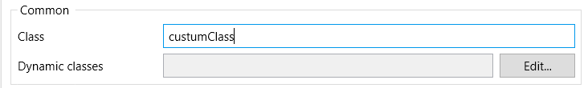
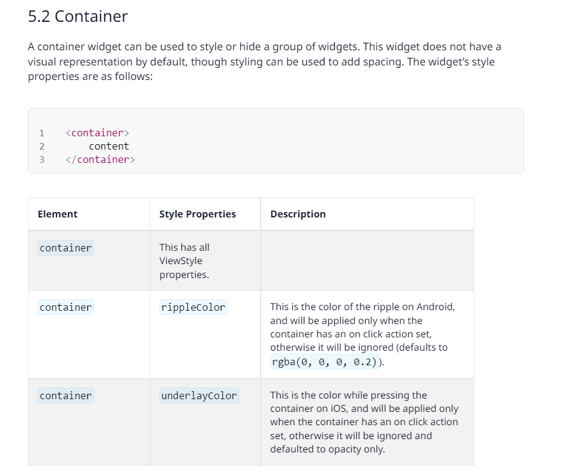

# Native Styling Simplified:

## Some ground roles about Native Styling:
- Styling is done using **Javascript objects** , Not **CSS rules**.
- No units added.
- If you have two classes with the same name, it will cause an error.
- Only flex and Absolute are used.
- Flex is applied by default to all elements.
- When using Absolute, it is always relative to its parent.
- Not all CSS properties apply to Native Styling.
- All the values of the properties are either a string or a number.

- Example of Native Styling:
```js
export const classExample = {
    container: {
        backgroundColor: "#3CB33D",
        borderRadius: 8,
        elevation: 20,
    },
}
```


## How to start Styling your App:
1. Using Design Properties in Mendix Studio Pro:


2. Update `./custom-variables.js` file (same as in web styling)

3. Custom Classes:
  1. Add the class name (camel-cased) to the element you want to style, let's say for example a `container`
  
  2. Check [this documentation](https://docs.mendix.com/refguide/mobile/designing-mobile-user-interfaces/widget-styling-guide/#native-mobile-styling) to see the structure of the container. Knowing the structure of the element is important to structure our javascript object


   1. the element name, container, is going to be used as a property in the javascript object.
   2. In the Style Properties, what is meant by the **ViewStyle properties**, are the React Native properties you can add to your element. You can check them from [this documentation](https://reactnative.dev/docs/view-style-props)

```javascript
export const custumClass = {
    container: {
        // add the style you need here where the key if the ViewStyle property name.
        shadowColor: "#000",
        shadowOpacity: 0.1,
        shadowRadius: 6,
        shadowOffset: {
            width: 0,
            height: -4
        }
    }
}
```
4. Configure and use your desgin properties (similar to the web)


## Resources:
- [Building a Native App with UX & Styling](https://www.youtube.com/watch?v=D1eQQzLQwtA)
- [Widget Styling Guide](https://docs.mendix.com/refguide/mobile/designing-mobile-user-interfaces/widget-styling-guide/#native-mobile-styling)
- [React Native Properties Documentation](https://reactnative.dev/docs/view-style-props#borderstyle)